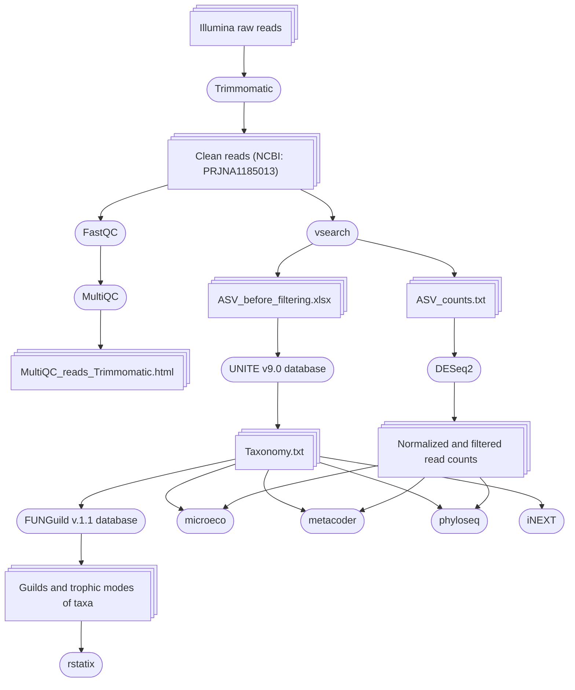

# Lithuania-metabar
## Metabarcoding analysis of fungi associated with roots of three plant species: _Diphasiastrum complanatum_, _Pinus sylvestris_ and _Vaccinium myrtillus_

> [!TIP]
> To view any HTML files, please, download them

### List of the files:

1. ASV_before_filtering.xlsx - all Amplicon Sequence Variants (ASVs) assigned to the fungi taxa using the UNITY database (before filtering for depth and match).
2. ASV_counts - row number of reads per ASVs per sample.
3. Data_analysis_R_script.Rmd - data analysis is as an R Markdown file.
4. Data_analysis_R_script.html - data analysis as an HTML file results in graphs or tables.
5. Info.txt - information about the samples including technical replicates: sample name ("Sample"), sample type ("Species"), sampling site ("Location"), and the part of the studied forest ("Forest").
6. Info_noR.txt - information about the samples excluding technical replicates: sample name ("Sample"), sample type ("Species"), sampling site ("Location"), part of the forest ("Forest"), age of the Pinus sylvestris at the location ("Age", years), Height of the Pinus sylvestris at the location ("Height", m), the diameter of the Diphasiastrum complanatum colony ("Diph_colony, m).
7. Taxonomy.txt - assignment of ASVs to fungi taxa (UNITE database v9.0), trophic mode and guild (FUNGuild v1.1 database): 
8. MultiQC_reads_Trimmomatic.html - MultiQC report on the quality of the trimmed reads.

## Workflow:

## Used programs:

#### Python packages:

* Trimmomatic v0.39 - trimming of adapters, low-quality bases and removing of low-quality reads
* vsearch v2.15 - merging of forward and reverse reads, quality filtering of reads, dereplication of reads across the samples and removal of singletons, pooling of the samples, denoising of the sequences, identification and removal of chimaera sequences using the UCHIME algorithm, applying both _de novo_ and reference-based detections, assignment of resulting sequences to Amplicon Sequence Variants (ASVs), taxonomical assignment of ASVs
  
#### R packages:

* DESeq2 v1.42 - normalization of read counts through variance stabilizing transformation
* phyloseq v1.41 - Principle Coordinate Analysis
* microeco v1.4.0 - calculation of taxonomic abundance per sample
* metacoder v0.3.7 - pairwise comparison of taxonomic abundances
* iNEXT v3.0.0 - calculation and visualisation of species diversity indices(Hill numbers) per tample type
* rstatix v0.7.2 - Kruskal-Wallis test with Dunn's post-hoc test for the abundancy of trophic modes and guilds among sample types 

