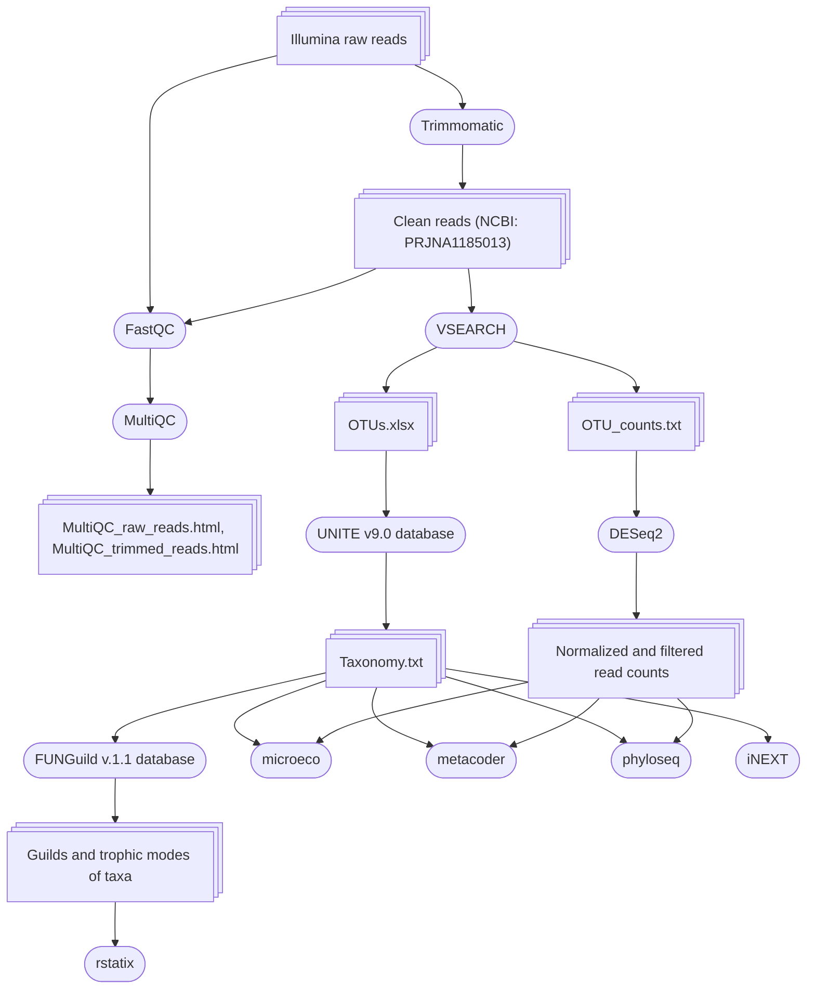

## Metabarcoding analysis of fungi associated with roots of three plant species:  _Diphasiastrum complanatum_, _Pinus sylvestris_ and _Vaccinium myrtillus_

> [!TIP]
> To view any HTML files, please, download them

### List of files:

* OTUs.xlsx - Operational Taxonomic Units (OTUs) assigned to the fungi taxa using the UNITY database.
* OTU_counts - row number of reads per OTU in each sample.
* Info.txt - information about the samples including technical replicates: sample name ("Sample"), sample type ("Species"), sampling site ("Location"), and the part of the studied forest ("Forest").
* Info_noR.txt - information about the samples excluding technical replicates: sample name ("Sample"), sample type ("Species"), sampling site ("Location"), part of the forest ("Forest"), age of the Pinus sylvestris at the location ("Age", years), Height of the Pinus sylvestris at the location ("Height", m), the diameter of the Diphasiastrum complanatum colony ("Diph_colony, m).
* Taxonomy.txt - assignment of OTUs to fungi taxa (UNITE database v9.0), trophic mode and guild (FUNGuild v1.1 database).
* MultiQC_raw_reads.html - MultiQC report on the quality of the raw reads.
* MultiQC_trimmed_reads.html - MultiQC report on the quality of the trimmed reads.
* Data_analysis_R_script.Rmd - script of the data analysis conducted in R.
* Data_analysis_R_script.html - data analysis as an HTML file results in graphs or tables.
* Trimmomatic_VSEARCH_FUNGuild.md - script of the data processing using Trimmomatic, VSEARCH and FUNGuild.

## Used programs:

#### Python packages:

* [Trimmomatic](http://www.usadellab.org/cms/index.php?page=trimmomatic) v0.33 - trimming of adapters, low-quality bases and removing of low-quality reads
* [VSEARCH](https://peerj.com/articles/2584/) v2.15 - merging of forward and reverse reads, quality filtering of reads, dereplication of reads across the samples and removal of singletons, pooling of the samples, denoising of the sequences, identification and removal of chimaera sequences using the UCHIME algorithm, applying both _de novo_ and reference-based detections, clustering of resulting sequences to OTUs, taxonomical assignment of OTUs
* [FastQC](https://www.bioinformatics.babraham.ac.uk/projects/fastqc/) v0.12.0 and [MultiQC](https://seqera.io/multiqc/) v1.14 -  quality reports for raw and trimmed reads
#### R packages:

* [DESeq2](https://genomebiology.biomedcentral.com/articles/10.1186/s13059-014-0550-8) v1.42 - normalization of read counts through variance stabilizing transformation
* [phyloseq](https://journals.plos.org/plosone/article?id=10.1371/journal.pone.0061217) v1.41 - Principle Coordinate Analysis
* [microeco](https://academic.oup.com/femsec/article/doi/10.1093/femsec/fiaa255/6041020?login=true) v1.4.0 - calculation of taxonomic abundance per sample
* [metacoder](https://journals.plos.org/ploscompbiol/article?id=10.1371/journal.pcbi.1005404) v0.3.7 - pairwise comparison of taxonomic abundances
* [iNEXT](https://besjournals.onlinelibrary.wiley.com/doi/10.1111/2041-210X.12613) v3.0.0 - calculation and visualisation of species diversity indices (Hill numbers) per tample type
* [rstatix](https://github.com/kassambara/rstatix) v0.7.2 - Kruskal-Wallis test with Dunn's post-hoc test for the abundancy of trophic modes and guilds among sample types 

## Workflow:

